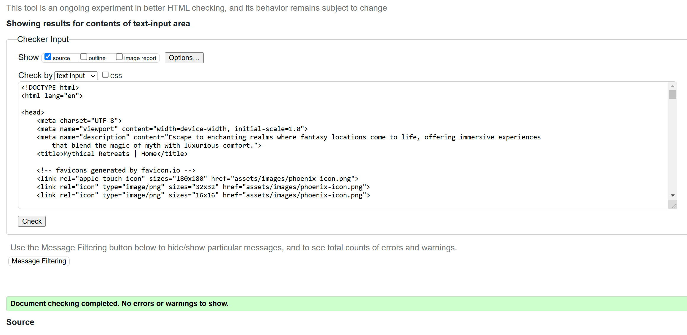

# **Mythical Retreats** 

## **Project Description**  

**Mythical Retreats** is a whimsical website offering fictional reservations to fantasy destinations that only exist in dreams and legends. Visitors can explore enchanting realms, book stays in mystical locations like cloud hotels, haunted palaces, or tropical pod rooms, and experience the magic of immersive, imaginary getaways—all from the comfort of their home. This meta-site invites users to step into a world where the impossible becomes reality.

## **Features**

- **Navigation**:  
  The website includes intuitive navigation with easy access to all key sections, ensuring a seamless user experience.

- **Phoenix Icon**:  
  A stylized phoenix icon appears in the browser tab and the upper left corner of the homepage, linking back to the homepage when clicked.

- **Top Right Links**:  
  The top right navigation bar features links to essential sections, including **Home**, **Locations**, **Contact**, and a **Booking** button that directs users to the booking form for easy reservations.

- **Elegant Navbar Font**:  
  The navigation bar uses a regal and elegant font, giving the site a refined and sophisticated look while guiding users effortlessly through the content.

  

- **User-Friendly Navigation**:  
  With the phoenix icon linking to the homepage and the clear, top-right links to key sections, everything is conveniently placed, making the site simple to explore.

## **Header**

- **Hero Image**:  
  The header features a stunning hero image of the fictional shoreline hotel, setting the tone for an unforgettable, dreamlike vacation experience.

- **Bold Title**:  
  A mighty and bold title, **"Mythical Retreats"**, sits prominently at the top of the page, immediately drawing the visitor into the fantasy world.

- **Sub-Heading with Description**:  
  Below the title is an elegant sub-heading with a paragraph that clearly describes the unique services offered. It highlights that **Mythical Retreats** caters to the discerning vacationer seeking exclusive, fantastical destinations and bespoke, otherworldly experiences.

## **Carousel and Location Cards**

- **Looping Images**:  
  The carousel showcases 4 beautifully looping images of the interiors from various fantasy destinations, immersing visitors in the ambiance and luxury of these fictional retreats.

  

- **Seasonal Locations**:  
  The carousel also highlights **four exclusive locations currently offered for the season**, each with unique pricing and accommodations:

  1. **The Cliffport** – A futuristic hotel perched above the clouds, offering breathtaking views and high-end amenities.
  2. **The Phantom Palace** – A haunted yet luxurious palace with opulent corridors and ghostly charm.
  3. **Tropic Pods Resort** – Sleek pod rooms nestled in a lush tropical paradise, perfect for relaxation.
  4. **Elderwood Commune** – A peaceful treehouse community hidden within an ancient forest, ideal for reconnecting with nature.

  

- **AI-Generated Cards**:  
  Each of the example cards for these locations was meticulously crafted by the website designer using advanced AI techniques, adding a modern, creative touch to the design.

## **Contact**

- **Address**:  
  Mythical Retreats  
  123 Mythical Retreat Blvd  
  Fantasy City, 12345

- **Email**:  
   info@mythical-retreats.co

- **Phone**:  
  0123456789

- **Social Links**:  
  The contact section also includes social media icons for easy access:
  - **Facebook**: [Facebook Icon]  
  - **Twitter**: [Twitter Icon]  
  - **Instagram**: [Instagram Icon]  

  These icons link directly to the **Mythical Retreats** social media profiles, keeping visitors connected to the latest news and updates.

  

## **Booking Form and Confirmation Page**

- **Header**:  
  The booking form is accessible through multiple points on the landing page, ensuring easy navigation for potential guests. It includes a welcoming header:  
  **"Book Your Fantasy Retreat Today!"**

- **Thank You Message**:  
  After submitting the form, users will be greeted with a friendly thank-you message:  
  _"Thank you for completing your booking with Mythical Retreats! Your dream adventure awaits, and we can't wait to make it a reality for you."_

- **Form Fields**:  
  The booking form includes the following input fields:
  - **Name**: A required field for the guest's full name.
  - **Email**: A required field for the guest's email address.
  - **Phone Number**: A required field for contact via phone.
  - **Retreat Location Selector**: A dropdown menu where guests can select their desired fantasy retreat (e.g., The Cliffport, Phantom Palace, Tropic Pods Resort, Elderwood Commune).
  - **Customized Message**: An optional field for guests to include any additional requests or preferences for their stay.

- **Submit Button**:  
  At the bottom of the form, guests can finalize their booking by clicking the **"Submit"** button, which will take them to a confirmation page with further instructions.

## **Testing and Confirmation**

- **Cross-Browser Testing**:  
  I tested the website on multiple browsers to ensure consistent performance and visual presentation, including Chrome, Firefox, and Safari.  

- **Responsive Design**:  
  I confirmed that the website is fully responsive across devices and adjusted all functions using browser DevTools, ensuring optimal display on desktops, tablets, and mobile devices.  

  

- **Comprehensive User Interface**:  
  I verified that the navigation, header, contact section, and booking form are all clearly readable, easy to use, and provide an excellent user experience.

- **Functionality Checks**:  
  I thoroughly tested the website’s functionality, ensuring that all buttons, links, and form fields work correctly. All required form fields are enforced to ensure the user completes the necessary information before submitting.  

  

## **Solved Bugs and Validation**

- **Stray Tags**:  
  Identified and removed stray HTML tags that were causing rendering issues, ensuring a cleaner and more organized codebase.

- **Open Tags**:  
  Found and closed any open HTML tags that could lead to layout problems or broken elements on the page, enhancing overall stability and functionality.

- **Improper Code Usage**:  
  Addressed instances of improper code usage, including deprecated attributes and ineffective CSS styles, resulting in improved performance and adherence to best coding practices.

- **Validator Checks**:  
  Ran both the CSS and HTML through their respective validators (W3C HTML Validator and W3C Jigsaw CSS Validator) and found no issues, confirming the code meets current web standards and best practices.

  

  

## **Deployment**

- **Enable GitHub Pages**:  
  Go to your repository settings on GitHub. Scroll down to the **GitHub Pages** section and select the branch you want to use for GitHub Pages (typically `main`), then click **Save**. This will make your website publicly accessible on the web.

## **Lighthouse Metrics at Deployment**

At the time of deployment, the Lighthouse performance metrics for the site were as follows:
- **Performance**: 97
- **Accessibility**: 95
- **Best Practices**: 100
- **SEO**: 100

## **Credits**

All content, including images and text, for **Mythical Retreats** has been created by the website designer. The layouts and styles were inspired by the Boardwalk Games example program, serving as a foundation for the whimsical and engaging design of the site.
